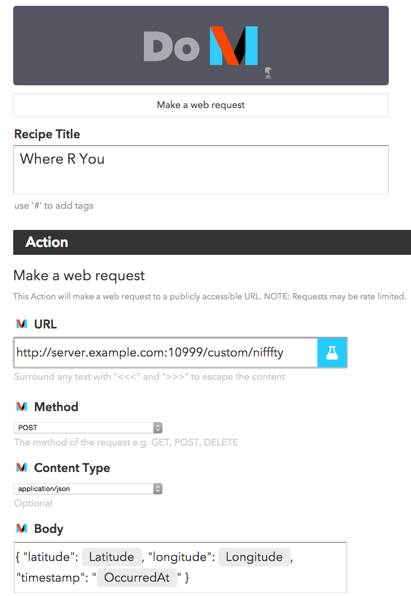

<!-- README.md is generated from README.Rmd. Please edit that file -->
<!-- [](https://travis-ci.org/hrbrmstr/nifffty) 
](http://www.repostatus.org/#concept)
[](http://cran.r-project.org/web/packages/nifffty) 
 -->


nifffty is a simple package to post events/data to an IFTTT Maker channel/recipe.

Inspired by a [blog post by Brian Connelly](http://bconnelly.net/2015/06/connecting-r-to-everything-with-ifttt/).

Here is a [sample public recipe](https://ifttt.com/recipes/300804-post-maker-event-values-to-dropbox-file) for posting the contents of a `maker` request to a file on Dropbox. The example below, which calls `maker("rtest", "this", "is a", "test")` will create a file in a Dropbox folder (in an `IFTTT/Maker/rtest` directory) that has the contents:

    Value 1: this
    Value 2: is a
    Value 3: test

(How the contents is formatted is entirely up to you.)

Brian's example posts an iOS notification, but you can do many, many things with this capability.

Future enhancements will include the ability to *receive* Maker web request actions.

The following functions are implemented:

-   `ifttt_api_key`: Get or set IFTTT\_KEY value
-   `maker`: Issue IFTTT maker channel POST event
-   `receiver`: Listen and react to IFTTT Maker web calls

### News

-   Version `0.0.0.9999` released
-   Version `0.1.0.9999` released

### Installation

``` r
devtools::install_github("hrbrmstr/nifffty")
```

### Usage

``` r
library(nifffty)

# current verison
packageVersion("nifffty")
#> [1] '0.1.0.9000'

maker("rtest", "this", "is a", "test")
```

To setup a receiver, create a script on a server that can receive requests from the internet (I named the following `listen.R`):

``` r
library(nifffty)

do_it <- function(req) {
  require(jsonlite)
  print(fromJSON(names(req$POST())))
  writeLines(names(req$POST()), "/tmp/bob.txt")
}

# you can change the port to match what you put into IFTTT

rcvr <- receiver(port=10999, handler=do_it)

print(rcvr)

while (TRUE) Sys.sleep(24 * 60 * 60)
```

For this example, I created an Apple Watch IFFFT "DO Button" to send my coordinates & timestamp when pressed:



Once that's setup, just call the script from the command-line:

    bob@server:~$ Rscript listen.R
    Loading required package: methods
    Loading required package: Rook
    Server started on 0.0.0.0:10999
    [1] nifffty http://0.0.0.0:10999/custom/nifffty

    Call browse() with an index number or name to run an application.
    Loading required package: jsonlite

    Attaching package: ‘jsonlite’

    The following object is masked from ‘package:utils’:

        View
        

When it receives an event it will print the following to the console:

    $latitude
    [1] 43.25931

    $longitude
    [1] -70.80062

    $timestamp
    [1] "June 19, 2015 at 04:45PM"

and, write the following to `/tmp/bob.txt`

    bob@server:~$ cat /tmp/bob.txt
    { "latitude": 43.2593566552207, "longitude": -70.8004647307757, "timestamp": "June 19, 2015 at 04:46PM" }

This same setup will work with any IFTTT action, not just "DO" buttons.

### Test Results

``` r
library(nifffty)
library(testthat)

date()
#> [1] "Fri Jun 19 17:05:44 2015"

test_dir("tests/")
#> basic functionality :
```

### Code of Conduct

Please note that this project is released with a [Contributor Code of Conduct](CONDUCT.md). By participating in this project you agree to abide by its terms.
